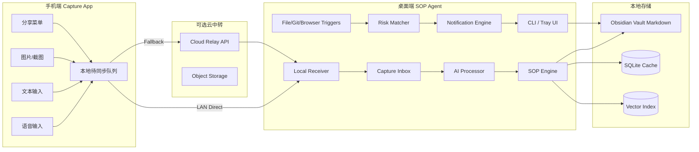
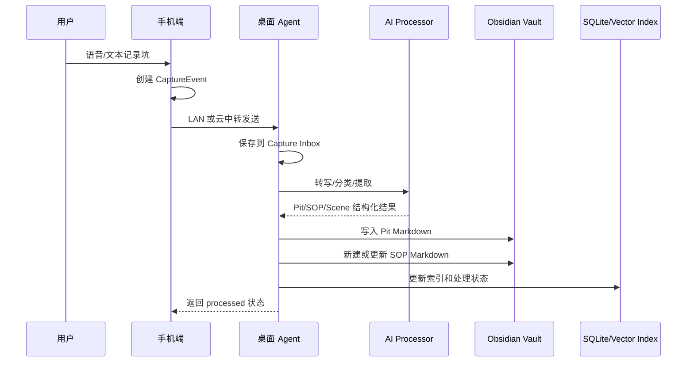
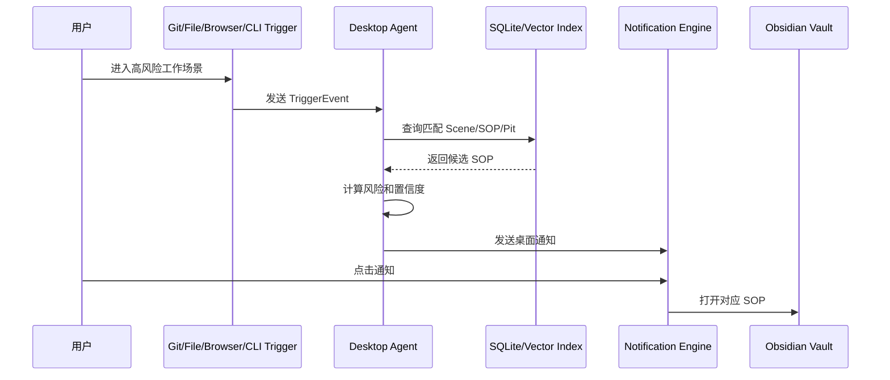
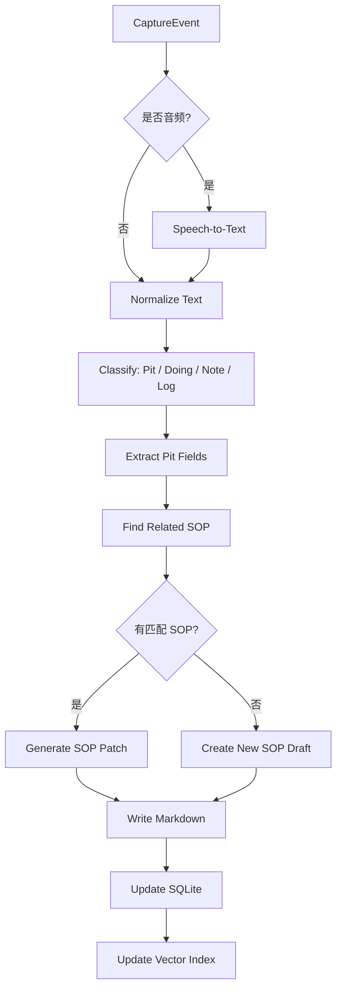

# Pit2SOP 架构设计

> 本文描述 Pit2SOP 的系统架构、模块边界、数据流、存储设计、同步策略和推荐技术栈。

---

## 1. 架构总览

Pit2SOP 使用 **手机输入 + 桌面主脑 + Obsidian 本地知识库** 的架构。



---

## 2. 系统边界

### 2.1 手机端边界

手机端只负责采集和发送：

- 录音
- 文本输入
- 图片 / 截图
- 分享菜单接收文本
- 本地待同步队列
- 与电脑配对
- 传输到电脑或云中转

手机端不负责：

- 长期知识库管理
- SOP 合并策略
- 全量搜索索引
- 桌面场景识别
- Obsidian 文件写入

### 2.2 桌面端边界

桌面端是主脑 Agent，负责：

- 接收来自手机、CLI、Git、浏览器、桌面的输入
- 转写音频
- AI 分析
- Markdown 生成
- Obsidian Vault 写入
- SQLite / 向量索引维护
- 监听桌面工作信号
- 风险匹配
- 通知提醒

### 2.3 Obsidian 边界

Obsidian 是内容编辑和长期存储层，负责：

- 人类可读的 Markdown 保存
- 双链组织
- 人工编辑
- Dashboard / Dataview 可视化
- 同步可由 Obsidian Sync、Git 或云盘处理

Obsidian 不负责：

- 后台监听
- AI 管线
- 手机同步协议
- 场景触发算法

---

## 3. 核心模块

## 3.1 Desktop Agent

桌面端 Agent 是核心模块，建议拆成以下子模块。

```text
Desktop Agent
├── App Shell
│   ├── Tray / Menu Bar
│   ├── Global Shortcut
│   └── Settings UI
│
├── Capture Layer
│   ├── Local HTTP Receiver
│   ├── WebSocket Receiver
│   ├── CLI Adapter
│   ├── Git Hook Adapter
│   ├── Browser Extension Adapter
│   └── File Watcher Adapter
│
├── Processing Layer
│   ├── Transcription Service
│   ├── Classification Service
│   ├── Pit Extractor
│   ├── SOP Generator
│   ├── Scene Matcher
│   └── Deduplication Service
│
├── Knowledge Layer
│   ├── Obsidian Writer
│   ├── Markdown Parser
│   ├── YAML Frontmatter Manager
│   ├── SQLite Repository
│   └── Vector Indexer
│
├── Trigger Layer
│   ├── Git Trigger
│   ├── File Change Trigger
│   ├── Browser Context Trigger
│   ├── Manual Doing Trigger
│   └── Calendar/Reminder Trigger
│
└── Reminder Layer
    ├── Risk Matcher
    ├── Notification Scheduler
    ├── Snooze / Ignore Manager
    └── SOP Launcher
```

---

## 3.2 Mobile Capture App

手机端结构：

```text
Mobile Capture App
├── Capture UI
│   ├── Hold-to-record
│   ├── Text input
│   ├── Image picker
│   └── Share extension
│
├── Local Queue
│   ├── Pending events
│   ├── Attachments
│   ├── Retry state
│   └── Delivery receipt
│
├── Pairing
│   ├── QR scan
│   ├── Device token
│   └── LAN endpoint cache
│
└── Transport
    ├── LAN direct sender
    ├── Cloud relay sender
    └── Status polling
```

---

## 4. 数据流

## 4.1 手机输入到 Obsidian



---

## 4.2 桌面场景触发提醒



---

## 5. 存储架构

## 5.1 Source of Truth

```text
Obsidian Markdown = source of truth
SQLite = 可重建缓存
Vector Index = 可重建缓存
```

任何重要内容都应落到 Markdown 文件中，包括：

- 原始记录
- AI 提炼结果
- SOP checklist
- Scene 触发规则
- 执行记录
- 周报复盘

SQLite 只保存：

- 处理状态
- 文件索引
- hash
- trigger 日志
- 通知状态
- embedding 引用
- 加速查询所需字段

---

## 5.2 Obsidian Vault 结构

```text
Pit2SOP/
├── 00_Inbox/
│   ├── Mobile Captures/
│   ├── Desktop Captures/
│   ├── Raw Logs/
│   └── Unprocessed/
│
├── 01_Pits/
│   ├── 2026/
│   └── Archive/
│
├── 02_SOPs/
│   ├── Development/
│   ├── Release/
│   ├── Client Delivery/
│   └── Personal Workflow/
│
├── 03_Scenes/
├── 04_Reviews/
├── 90_Attachments/
└── 99_System/
```

---

## 5.3 SQLite 逻辑表

### capture_events

| 字段 | 类型 | 说明 |
|---|---|---|
| id | text pk | CaptureEvent ID |
| source_device | text | 来源设备 |
| source_type | text | voice/text/image/share/cli/git |
| status | text | pending/processing/processed/failed |
| created_at | text | 创建时间 |
| received_at | text | 桌面端接收时间 |
| raw_text | text | 原始文本 |
| attachment_path | text | 附件路径 |
| obsidian_path | text | 对应 inbox 文件 |
| error | text | 失败原因 |

### pits

| 字段 | 类型 | 说明 |
|---|---|---|
| id | text pk | Pit ID |
| title | text | 标题 |
| scenario | text | 场景 |
| risk | text | 风险等级 |
| recurrence | text | 复发概率 |
| sop_id | text | 关联 SOP |
| file_path | text | Markdown 文件路径 |
| created_at | text | 创建时间 |

### sops

| 字段 | 类型 | 说明 |
|---|---|---|
| id | text pk | SOP ID |
| title | text | SOP 名称 |
| status | text | active/draft/archived |
| risk | text | 风险等级 |
| version | integer | 版本 |
| file_path | text | Markdown 文件路径 |
| updated_at | text | 更新时间 |

### scenes

| 字段 | 类型 | 说明 |
|---|---|---|
| id | text pk | Scene ID |
| name | text | 场景名称 |
| risk | text | 风险等级 |
| trigger_keywords | text/json | 关键词 |
| matched_sops | text/json | 关联 SOP |
| file_path | text | Markdown 文件路径 |

### trigger_events

| 字段 | 类型 | 说明 |
|---|---|---|
| id | text pk | TriggerEvent ID |
| source | text | git/file/browser/manual/calendar |
| payload | text/json | 原始触发数据 |
| detected_scene | text | 识别场景 |
| matched_sop | text | 匹配 SOP |
| confidence | real | 置信度 |
| action | text | notified/ignored/snoozed/opened |
| created_at | text | 时间 |

---

## 6. 传输架构

## 6.1 手机到电脑的传输策略

推荐双通道：

```text
优先 LAN Direct
失败则 Cloud Relay
电脑不在线则手机本地排队
电脑上线后自动补传
```

### LAN Direct

桌面 Agent 启动本地 HTTP 服务：

```text
POST http://<desktop-ip>:8765/v1/captures
```

配对流程：

```text
1. 桌面端显示二维码
2. 手机扫码获取 desktop_id、endpoint、pairing_token
3. 手机保存设备信息
4. 后续发送 CaptureEvent 时附带 token
```

### Cloud Relay

云中转只负责临时存储和转发：

```text
Phone → Cloud Relay → Desktop Agent
```

Cloud Relay 不做主存储。电脑端拉取成功后，可标记为 delivered。

---

## 6.2 消息格式

### CaptureEvent

```json
{
  "id": "cap_01JX9ZP3R4K7",
  "source_device": "iPhone 15",
  "source_type": "voice",
  "created_at": "2026-05-22T15:30:00+09:00",
  "timezone": "Asia/Tokyo",
  "raw_text": "今天上线又漏了 CI secret，导致 production API 请求失败。",
  "attachments": [
    {
      "type": "audio",
      "filename": "cap_01JX9ZP3R4K7.m4a",
      "mime_type": "audio/mp4",
      "size_bytes": 238912
    }
  ],
  "context": {
    "app_source": "Pit2SOP Mobile",
    "manual_tags": ["release", "ci"]
  },
  "processing_status": "pending"
}
```

### ProcessingResult

```json
{
  "capture_id": "cap_01JX9ZP3R4K7",
  "status": "processed",
  "created_pit": {
    "id": "pit_01JX9ZQH2A",
    "path": "01_Pits/2026/2026-05-22 CI secret 未更新导致发布失败.md"
  },
  "updated_sop": {
    "id": "sop_ios_release",
    "path": "02_SOPs/Release/SOP - iOS 发布前检查.md"
  },
  "suggested_scene": "iOS 发布"
}
```

---

## 7. AI 处理管线



## 7.1 分类类型

| 类型 | 说明 |
|---|---|
| pit | 具体踩坑记录 |
| doing | 用户将要做一件事，需要推荐 SOP |
| note | 普通笔记，暂不生成 SOP |
| log | 错误日志或原始材料 |
| sop_request | 用户明确要求生成 SOP |

## 7.2 Pit 提取字段

```json
{
  "pit_title": "CI secret 未更新导致 production 请求失败",
  "scenario": "iOS 发布",
  "symptom": "production API 请求失败",
  "root_cause": "CI secret 没有同步更新",
  "fix": "更新 CI secret 并重新打包",
  "prevention_rule": "发布前必须检查 CI secret 和 production config",
  "sop_candidate": "SOP - iOS 发布前检查",
  "trigger_keywords": ["release", "发布", "production", "CI", "App Store"],
  "risk_level": "high",
  "recurrence_probability": "high"
}
```

---

## 8. Markdown 写入策略

## 8.1 Pit 文件模板

```markdown
---
type: pit
id: pit_01JX9ZQH2A
created: 2026-05-22T15:30:00+09:00
source: mobile_voice
status: processed
scenario: iOS 发布
risk: high
recurrence: high
sop: "[[SOP - iOS 发布前检查]]"
tags:
  - pit
  - ios
  - release
  - ci
---

# CI secret 未更新导致 production 请求失败

## 原始记录

今天上线又漏了 CI secret，导致 production API 请求失败。

## AI 提炼

### 表面症状
production API 请求失败。

### 根因
CI/CD 中的 secret 没有同步更新。

### 修复方式
更新 CI secret，重新打包并验证 production API baseURL。

### 防错规则
发布前必须检查本地配置、CI secret、production config 是否一致。

## 建议加入 SOP

- [ ] 检查 CI secret 是否为最新值
- [ ] 检查 production API baseURL
- [ ] 检查构建来源分支

## 关联

- SOP：[[SOP - iOS 发布前检查]]
- 场景：[[iOS 发布]]
```

## 8.2 SOP 文件模板

```markdown
---
type: sop
id: sop_ios_release
version: 3
status: active
risk: high
scenarios:
  - iOS 发布
  - App Store 提审
  - TestFlight 发布
triggers:
  - release
  - App Store
  - TestFlight
  - production
  - CI
  - 提审
  - 上线
related_pits:
  - "[[CI secret 未更新导致 production 请求失败]]"
tags:
  - sop
  - ios
  - release
---

# SOP - iOS 发布前检查

## 适用场景

- App Store 提审
- TestFlight 发布
- production 构建
- release 分支合并
- CI/CD 发版

## 检查清单

### 1. 代码与分支

- [ ] 当前分支是否正确
- [ ] release tag 是否正确
- [ ] changelog 是否更新

### 2. 环境配置

- [ ] 本地 `.env` 是否指向 production
- [ ] CI secret 是否更新
- [ ] production API baseURL 是否正确

<!-- pit2sop:start:auto-items -->
- [ ] 检查 CI secret 是否为最新值
<!-- pit2sop:end:auto-items -->

## 历史坑点

- [[CI secret 未更新导致 production 请求失败]]
```

---

## 9. SOP 更新策略

Agent 自动更新 SOP 时必须遵守：

1. 不覆盖人工编辑区域。
2. 优先写入 marker 区块。
3. 新增项需要去重。
4. 重大结构变更进入“待确认”状态。
5. 每次自动更新增加版本号或记录 changelog。

推荐 marker：

```markdown
<!-- pit2sop:start:auto-items -->
<!-- pit2sop:end:auto-items -->
```

推荐 changelog：

```markdown
## 更新记录

- 2026-05-22：根据 [[CI secret 未更新导致 production 请求失败]] 新增 CI secret 检查项。
```

---

## 10. 触发与提醒架构

## 10.1 TriggerEvent 来源

| 来源 | 示例 |
|---|---|
| manual | 用户输入“我要上线” |
| git | 创建 release 分支、push main、git tag |
| file | 修改 migration.sql、fastlane、CI workflow |
| browser | 打开 GitHub Release、App Store Connect |
| cli | 执行 `sop check release` |
| calendar | 日历事件“提交 App Store 审核” |
| reminder | 提醒事项“上线 2.5.0” |

## 10.2 风险匹配

匹配得分建议由以下因素组成：

```text
score = keyword_score
      + scene_score
      + semantic_score
      + recent_pit_score
      + risk_weight
      - ignored_recently_penalty
```

提醒阈值：

| 分数 | 行为 |
|---|---|
| >= 0.85 | 立即通知 |
| 0.65 - 0.85 | 放入今日建议 |
| 0.45 - 0.65 | 仅在 App 内显示 |
| < 0.45 | 忽略 |

## 10.3 通知内容

通知应包含：

- 检测到的场景
- 推荐 SOP
- 触发原因
- 关联历史坑点
- 打开 SOP 按钮
- 稍后提醒按钮
- 忽略本次按钮

示例：

```text
检测到你正在进入 iOS 发布流程。
推荐执行：SOP - iOS 发布前检查。
历史坑点：CI secret 未更新、证书过期、审核账号不可用。
```

---

## 11. 可靠性设计

### 11.1 手机离线

手机端必须支持本地队列：

```text
pending → sending → delivered → processed
```

如果发送失败，指数退避重试。

### 11.2 电脑离线

如果电脑不在线：

- 手机端保存在本地队列
- 如果配置了云中转，则上传到云中转
- 电脑上线后拉取未处理事件

### 11.3 写 Obsidian 文件失败

失败时：

- 不丢弃 CaptureEvent
- 写入 `00_Inbox/Unprocessed/`
- SQLite 标记 `failed`
- 错误原因可见
- 支持手动重试

### 11.4 防止覆盖人工修改

写文件流程：

```text
读取文件
计算 hash
定位 marker 区域
合并变更
写入临时文件
原子替换
更新索引
```

---

## 12. 安全与配对

虽然项目是个人自用，不以隐私为第一优先级，但仍应避免误传和丢数据。

最低要求：

- 手机与电脑通过二维码配对
- 每台设备有 device_id
- 每次请求带 pairing_token
- LAN API 只监听本机局域网或指定接口
- 附件上传限制大小
- Cloud Relay 使用 token 鉴权
- 所有 CaptureEvent 有唯一 ID，支持幂等处理

---

## 13. 推荐开发路线

### Phase 1：本地闭环

```text
Desktop Agent
+ Obsidian Writer
+ AI Processor
+ SQLite Index
+ CLI 输入
```

### Phase 2：手机输入

```text
Mobile App
+ QR 配对
+ LAN 发送
+ 本地队列
```

### Phase 3：场景触发

```text
Git Hook
+ File Watcher
+ Desktop Notification
```

### Phase 4：外部信号

```text
Browser Extension
+ Calendar/Reminder
+ Cloud Relay
```

### Phase 5：高级知识系统

```text
Obsidian Plugin
+ SOP 执行记录
+ 周报复盘
+ 自动合并重复 SOP
```

---

## 14. 架构结论

推荐最终形态：

```text
Phone Capture App
→ Desktop SOP Agent
→ Obsidian Markdown Vault
→ SQLite / Vector Cache
→ Desktop Reminder System
```

核心原则：

> **Obsidian 保存长期知识；Desktop Agent 负责智能化；手机只负责随手输入。**
